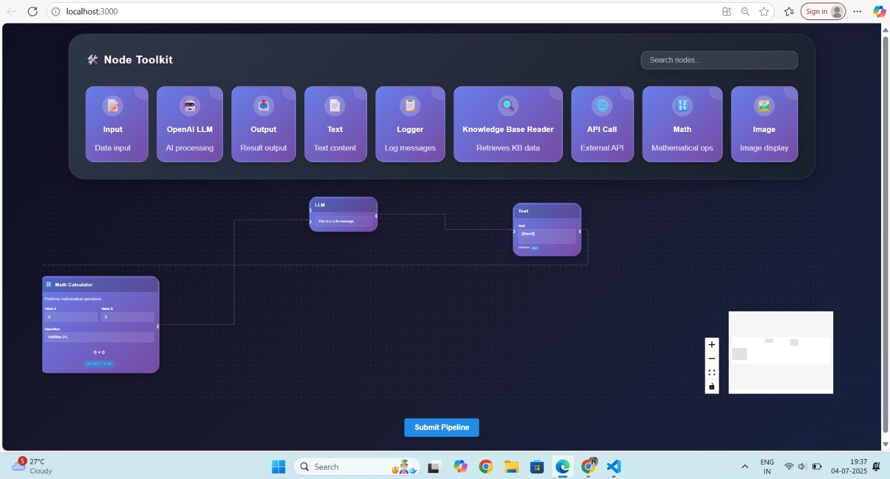

# 🧠 No-Code Pipeline Builder (Frontend + Backend)

A visual drag-and-drop interface to build AI or data pipelines using custom nodes — built with **React Flow**, **Mantine UI**, and **FastAPI**.

---

## 🚀 Features

### ✅ Frontend (React + Mantine + React Flow)

- **Node Toolkit**: A visually styled horizontal toolbar with draggable node types like Input, Output, Text, Math, Logger, etc.
- **BaseNode Abstraction**: All node types (like Input, Output, API Call, etc.) are built on a shared, reusable `BaseNode` component, making the code scalable, consistent, and easier to maintain.
- **Drag-and-Drop Canvas**: Built with React Flow, where users can place and connect nodes.
- **Dynamic Nodes**:
  - Input/Output
  - LLM (Text box)
  - Math Calculator
  - API Caller
  - Image Viewer
  - Logger
  - Knowledge Base Reader
  - Text Formatter (detects variables like `{{input}}`)
- **Live Inputs**: Node values update in real-time with styled input fields (Mantine).
- **Handle-Based Connections**: Nodes have input/output points for building logic flow.
- **Search Functionality**: Search bar to filter visible nodes in the toolbar.
- **Minimap + Zoom Controls**: Canvas navigation tools in bottom-right.
- **Submit Button**: Sends the pipeline's current structure (nodes + connections) to the backend API.
- **Node Deletion**: Delete selected nodes with `Delete` or `Backspace` key.

---

### 🛠️ Backend (FastAPI)

- Accepts pipeline structure via `/pipelines/parse` endpoint.
- Ready to be extended for execution logic or storing pipelines.

---

## 🧱 Tech Stack

| Layer      | Tech                     |
|------------|--------------------------|
| Frontend   | React, React Flow, Mantine UI |
| State Mgmt | Zustand                  |
| Styling    | Dark theme, gradients    |
| Backend    | Python + FastAPI         |

---

## 🧩 How it Works

1. Drag nodes from the toolbar into the canvas.
2. Connect nodes using handles to define the flow.
3. Fill in inputs (e.g., numbers in MathNode, API URL in APICallNode).
4. Use `Submit Pipeline` to send the entire node & edge structure to the backend.

---

## 📷 UI Snapshot




---

## 🧑‍💻 Getting Started

### 🖥️ Setup


```bash
cd frontend
npm install
npm start

cd backend
pip install -r requirements.txt
uvicorn main:app --reload

